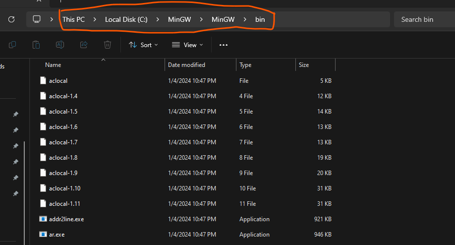
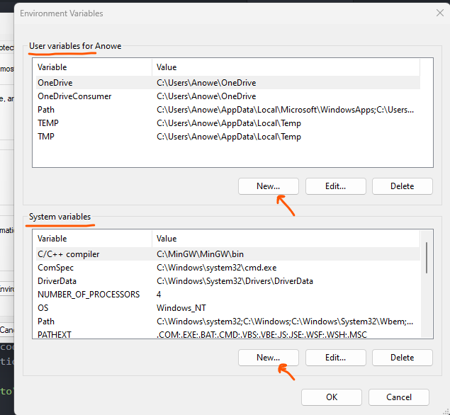
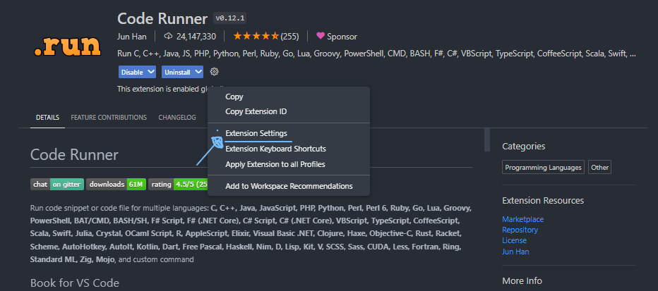
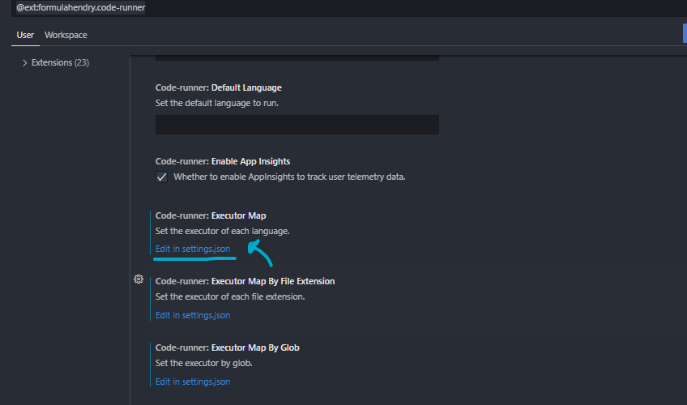

### 1st
[VS Code - (Download)](https://code.visualstudio.com/download)


### 2nd 

[MingW Compiler - (Download)](https://drive.google.com/file/d/1DNi19ocKwHWopyYCfTHZGM96puRsGtOQ/view?fbclid=IwAR2ZPt_uPr-w2tmD9CN8I1JiQ3wVs-uwv3Rz9LoA0rljd7Tp0PyM3GjqTwY) 

<h4> - MingW  Extract  C-Drive</h4>
<h4> - Copy path then paste enviroment virables</h4>



<h4> - </h4>


## Settings.json -

<h4>1. Install C/C++ vscode extension</h4>
<h4>2. Install code runner vscode extension</h4>
<h4> - Then select setting option</h4>



<h3> - Edit setting.json</h3>




<h3> - Copy all text and paste </h3>

<p></p>

```json

{
    "C_Cpp.default.cppStandard": "c++20",
    "C_Cpp.default.cStandard": "c11",
    "terminal.integrated.defaultProfile.windows": "Git Bash",
    "code-runner.runInTerminal": true,
    "code-runner.saveAllFilesBeforeRun": true,
    "code-runner.terminalRoot": "/",
    "code-runner.executorMapByGlob": {
    
        "pom.xml": "cd $dir && mvn clean package"
    },
    "code-runner.executorMap": {
        "javascript": "node",
        "java": "cd $dir && javac $fileName && java $fileNameWithoutExt",
        "zig": "zig run",
        "objective-c": "cd $dir && gcc -framework Cocoa $fileName -o $fileNameWithoutExt && $dir$fileNameWithoutExt",
        "php": "php",
        "python": "python -u",
        "perl": "perl",
        "perl6": "perl6",
        "ruby": "ruby",
        "go": "go run",
        "lua": "lua",
        "groovy": "groovy",
        "powershell": "powershell -ExecutionPolicy ByPass -File",
        "bat": "cmd /c",
        "shellscript": "bash",
        "fsharp": "fsi",
        "csharp": "scriptcs",
        "vbscript": "cscript //Nologo",
        "typescript": "ts-node",
        "coffeescript": "coffee",
        "scala": "scala",
        "swift": "swift",
        "julia": "julia",
        "crystal": "crystal",
        "ocaml": "ocaml",
        "r": "Rscript",
        "applescript": "osascript",
        "clojure": "lein exec",
        "haxe": "haxe --cwd $dirWithoutTrailingSlash --run $fileNameWithoutExt",
        "rust": "cd $dir && rustc $fileName && $dir$fileNameWithoutExt",
        "racket": "racket",
        "scheme": "csi -script",
        "ahk": "autohotkey",
        "autoit": "autoit3",
        "dart": "dart",
        "pascal": "cd $dir && fpc $fileName && $dir$fileNameWithoutExt",
        "d": "cd $dir && dmd $fileName && $dir$fileNameWithoutExt",
        "haskell": "runghc",
        "nim": "nim compile --verbosity:0 --hints:off --run",
        "lisp": "sbcl --script",
        "kit": "kitc --run",
        "v": "v run",
        "sass": "sass --style expanded",
        "scss": "scss --style expanded",
        "less": "cd $dir && lessc $fileName $fileNameWithoutExt.css",
        "FortranFreeForm": "cd $dir && gfortran $fileName -o $fileNameWithoutExt && $dir$fileNameWithoutExt",
        "fortran-modern": "cd $dir && gfortran $fileName -o $fileNameWithoutExt && $dir$fileNameWithoutExt",
        "fortran_fixed-form": "cd $dir && gfortran $fileName -o $fileNameWithoutExt && $dir$fileNameWithoutExt",
        "fortran": "cd $dir && gfortran $fileName -o $fileNameWithoutExt && $dir$fileNameWithoutExt",
        "sml": "cd $dir && sml $fileName",
        "c": "cd $dir && gcc $fileName -o $fileNameWithoutExt.exe && $dir$fileNameWithoutExt.exe",
        "cpp": "cd $dir && g++ $fileName -o $fileNameWithoutExt.exe && $dir$fileNameWithoutExt.exe",
    },
    
    "window.zoomLevel": 1,
    
}

```


### Done! 